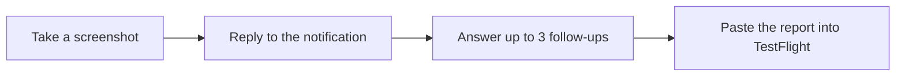

# BetaFeedbackKit

BetaFeedbackKit turns vague TestFlight screenshots into structured, developer-ready reports without a backend or bug form. Testers do less work; you get their original words, targeted follow-ups, and relevant app context.

It can:
- show lightweight screenshot guidance
- ask up to three short follow-up questions on-device
- add app, device, and developer-provided context
- copy the finished report for TestFlight

## How it works



If notifications or the on-device model are unavailable, the flow shortens instead of failing.

## Install

Add `https://github.com/AndreasInk/BetaFeedbackKit` in Xcode's package dependencies, or add it to `Package.swift`:

```swift
dependencies: [
    .package(
        url: "https://github.com/AndreasInk/BetaFeedbackKit",
        branch: "main"
    )
]
```

Then add the `BetaFeedbackKit` library product to your app target.

- iOS 17+
- macOS 14+
- Swift 6.2+
- Xcode 27+ for Foundation Models, StateReporting, and MetricKit features

## Quick start

```swift
import SwiftUI
import BetaFeedbackKit

struct ContentView: View {
    @State private var feedback = BetaContentViewModel(
        allowsFeedbackPasteboardExport: true,
        feedbackContextProvider: {
            [
                "screen": "checkout",
                "recent_action": "Tapped Continue"
            ]
        },
        feedbackClarificationMode: .onDevice,
        feedbackNotificationMode: .onScreenshot
    )

    var body: some View {
        CheckoutView()
            .beta(viewModel: feedback)
            .task { feedback.setup() }
    }
}
```

`feedbackClarificationMode: .onDevice` lets Apple's on-device model ask a follow-up in the feedback sheet. `feedbackNotificationMode: .onScreenshot` starts the multi-turn notification flow after a screenshot. Both are opt-in.

## Notification feedback on iOS 27

- A short popover beside the screenshot preview shows the current screen or feature when supplied.
- The first notification asks for one text reply.
- The on-device model may ask up to three short follow-ups. “I don’t know” ends that line of questioning.
- With pasteboard export enabled, the finished report is copied and the tester is guided back to TestFlight to paste it.

For example:

> “Continue didn’t work.”

BetaFeedbackKit might ask:

> “When you tapped Continue, did the screen stay the same, or did you see an error?”

The original answer, clarification, and app context are kept in the final report.

### Forward notification responses

Your app owns `UNUserNotificationCenter.delegate`. Forward BetaFeedbackKit notifications from that delegate:

```swift
import BetaFeedbackKit
import UserNotifications

extension AppDelegate: UNUserNotificationCenterDelegate {
    func userNotificationCenter(
        _ center: UNUserNotificationCenter,
        didReceive response: UNNotificationResponse,
        withCompletionHandler completionHandler: @escaping () -> Void
    ) {
        if feedbackViewModel.handleNotificationResponse(
            response,
            completionHandler: completionHandler
        ) {
            return
        }

        completionHandler()
    }

    func userNotificationCenter(
        _ center: UNUserNotificationCenter,
        willPresent notification: UNNotification,
        withCompletionHandler completionHandler:
            @escaping (UNNotificationPresentationOptions) -> Void
    ) {
        completionHandler(
            feedbackViewModel.notificationPresentationOptions(for: notification) ?? []
        )
    }
}
```

Set the delegate during app launch and keep the same `BetaContentViewModel` available to it. Foreground banners require the `willPresent` forwarding shown above.

On older systems or without notification access, BetaFeedbackKit falls back to normal TestFlight sharing; if only the model is unavailable, it prepares the tester's first response without follow-ups.

## Privacy

- Analysis stays on-device with no backend, API key, account, or external model provider. Active conversations remain in the host app's `UserDefaults` for up to 24 hours; an optional app-rendered screenshot stays in memory only.
- Notification `userInfo` contains routing IDs only, while visible questions may reflect supplied feedback or context. Analytics contain flow metadata, never tester responses; do not supply personal data, tokens, or private URLs as context.

## Advanced options

- `feedbackScreenshotProvider` adds an in-memory app image for on-device analysis.
- `.betaState(domain:state:metadata:)` adds app state. `feedbackDiagnosticsMode: .onDevice` adds privacy-filtered MetricKit evidence when available.
- `onFeedbackPrepared` and `latestFeedbackReport` expose the finished report.
- `beta-feedback` and `beta-screenshot-tip` are supported deep-link hosts through `handleDeepLink(_:)`.
- `startFeedbackNotificationConversation()` starts the same flow from a debug menu or custom trigger.

## Development

Run `swift test` for deterministic coverage. Xcode 27 also runs the Apple Evaluations test, which scores clarification quality across text, conversation-history, and bundled screenshot fixtures using the on-device model.

## License

MIT
