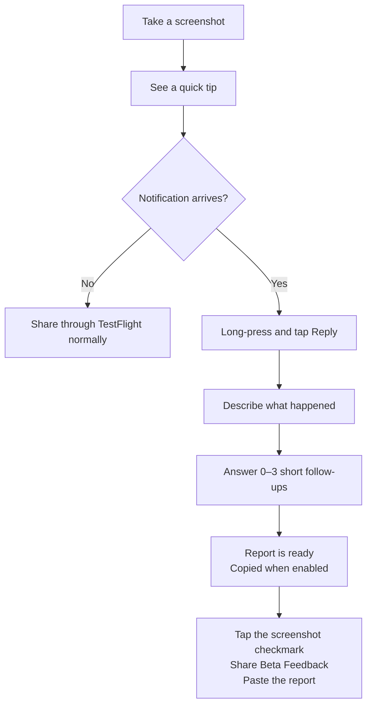

# BetaFeedbackKit

BetaFeedbackKit helps TestFlight testers turn a screenshot into useful feedback with very little effort.

It can:

- show lightweight screenshot guidance
- ask up to three short follow-up questions on-device
- add app, device, and developer-provided context
- copy the finished report for TestFlight

## How it works



If notifications or the on-device model are unavailable, the flow shortens instead of failing.

## Install

Add `https://github.com/AndreasInk/BetaFeedbackKit` in Xcode's package dependencies.

- iOS 17+
- macOS 14+
- Swift 6.2+
- Xcode 27+ for Foundation Models, StateReporting, and MetricKit features

## Quick start

```swift
import SwiftUI
import BetaFeedbackKit

struct ContentView: View {
    @State private var feedback = BetaContentViewModel(
        allowsFeedbackPasteboardExport: true,
        feedbackContextProvider: {
            [
                "screen": "checkout",
                "recent_action": "Tapped Continue"
            ]
        },
        feedbackClarificationMode: .onDevice,
        feedbackNotificationMode: .onScreenshot
    )

    var body: some View {
        CheckoutView()
            .beta(viewModel: feedback)
            .task { feedback.setup() }
    }
}
```

Both intelligent clarification and notification conversations are off by default.

## Notification feedback on iOS 27

- A short popover beside the screenshot preview shows the current screen or feature when supplied.
- The first notification asks for one text reply.
- The on-device model may ask up to three short follow-ups. “I don’t know” ends that line of questioning.
- With pasteboard export enabled, the finished report is copied and the tester is guided back to TestFlight to paste it.

For example:

> “Continue didn’t work.”

BetaFeedbackKit might ask:

> “When you tapped Continue, did the screen stay the same, or did you see an error?”

The original answer, clarification, and app context are kept in the final report.

### Forward notification responses

Your app owns `UNUserNotificationCenter.delegate`. Forward BetaFeedbackKit notifications from that delegate:

```swift
import BetaFeedbackKit
import UserNotifications

extension AppDelegate: UNUserNotificationCenterDelegate {
    func userNotificationCenter(
        _ center: UNUserNotificationCenter,
        didReceive response: UNNotificationResponse,
        withCompletionHandler completionHandler: @escaping () -> Void
    ) {
        if feedbackViewModel.handleNotificationResponse(
            response,
            completionHandler: completionHandler
        ) {
            return
        }

        completionHandler()
    }

    func userNotificationCenter(
        _ center: UNUserNotificationCenter,
        willPresent notification: UNNotification,
        withCompletionHandler completionHandler:
            @escaping (UNNotificationPresentationOptions) -> Void
    ) {
        completionHandler(
            feedbackViewModel.notificationPresentationOptions(for: notification) ?? []
        )
    }
}
```

Set the delegate during app launch and keep the same `BetaContentViewModel` available to it. Foreground banners require the `willPresent` forwarding shown above.

On iOS 17–26, or when notifications cannot be used, the package falls back to normal TestFlight screenshot sharing. If Foundation Models is unavailable, the tester's first answer is still prepared without more questions.

## Privacy

- Foundation Models analysis runs on-device. There is no backend, API key, account, or external model provider.
- An active conversation is stored in the host app's `UserDefaults` for up to 24 hours. It includes tester responses, captured context, generated analysis, and the finished report.
- Notification `userInfo` contains routing IDs only. The visible notification text contains the current question, which may be generated from the supplied feedback and context.
- An optional app-rendered screenshot stays in memory for the active conversation and is never added to the report.
- BetaFeedbackKit analytics contain flow metadata, not tester responses.

Do not place personal data, tokens, or URLs in developer context or state labels.

## Advanced options

- `feedbackScreenshotProvider` adds an in-memory app image for on-device analysis.
- `.betaState(domain:state:metadata:)` adds app state. `feedbackDiagnosticsMode: .onDevice` adds privacy-filtered MetricKit evidence when available.
- `onFeedbackPrepared` and `latestFeedbackReport` expose the finished report.
- `beta-feedback` and `beta-screenshot-tip` are supported deep-link hosts through `handleDeepLink(_:)`.
- `startFeedbackNotificationConversation()` starts the same flow from a debug menu or custom trigger.

The package keeps the tester's original words. Generated summaries are extractive, and no reproduction steps are invented.

## Development

```bash
swift build
swift test
```

## License

MIT
