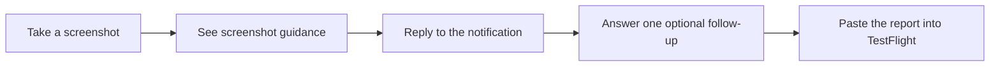

# BetaFeedbackKit

BetaFeedbackKit turns vague TestFlight screenshots into structured, developer-ready reports without a backend or bug form. Testers do less work; you get their original words, one targeted follow-up, and relevant app context.

It can:
- show lightweight screenshot guidance
- ask at most one short follow-up question on-device
- add app, device, and developer-provided context
- copy the finished report for TestFlight

## How it works



If notifications or the on-device model are unavailable, the flow shortens instead of failing.

## Install

Add `https://github.com/AndreasInk/BetaFeedbackKit` in Xcode's package dependencies, or add it to `Package.swift`:

```swift
dependencies: [
    .package(
        url: "https://github.com/AndreasInk/BetaFeedbackKit",
        branch: "main"
    )
]
```

Then add the `BetaFeedbackKit` library product to your app target.

- iOS 17+
- macOS 14+
- Swift 6.2+
- Xcode 27+ for Foundation Models, StateReporting, and MetricKit features

## Quick start

```swift
import SwiftUI
import BetaFeedbackKit

struct ContentView: View {
    @State private var feedback = BetaContentViewModel(
        allowsFeedbackPasteboardExport: true,
        feedbackContextProvider: {
            [
                "screen": "checkout",
                "recent_action": "Tapped Continue",
                "domain_context": "Checkout reserves an item before payment and shows confirmation after the reservation succeeds."
            ]
        },
        feedbackClarificationMode: .onDevice,
        feedbackNotificationMode: .onScreenshot
    )

    var body: some View {
        CheckoutView()
            .beta(viewModel: feedback)
            .task { feedback.setup() }
    }
}
```

`feedbackClarificationMode: .onDevice` lets Apple's on-device model ask one follow-up in the feedback sheet. `feedbackNotificationMode: .onScreenshot` starts the notification flow after a screenshot. Both are opt-in. Because the first notification arrives while the app is foregrounded, `.onScreenshot` also requires the `willPresent` delegate forwarding shown below.

Use `feedbackContextProvider` to include short, factual app context in the developer-facing
report. This context is not sent to the on-device model. Do not include personal data, secrets,
tokens, private URLs, or speculative causes.

## Notification feedback on iOS 27

- A short popover beside the screenshot preview shows the current screen or feature when supplied.
- BetaFeedbackKit starts the notification flow after showing that guidance; the first notification is scheduled for one second later without waiting for a background transition.
- The first notification asks for one text reply.
- The on-device model may ask one short follow-up. After the tester answers or skips it, the report is complete.
- With pasteboard export enabled, the finished report is copied and the tester is guided back to TestFlight to paste it.

For example:

> “Continue didn’t work.”

BetaFeedbackKit might ask:

> “When you tapped Continue, did the screen stay the same, or did you see an error?”

The original question, exact tester answer, clarification, and app context are kept in the final report. Model output is labeled as a generated issue category rather than presented as tester-authored fact.

### Forward notification responses

Your app owns `UNUserNotificationCenter.delegate`. Forward BetaFeedbackKit notifications from that delegate:

```swift
import BetaFeedbackKit
import UserNotifications

extension AppDelegate: UNUserNotificationCenterDelegate {
    func userNotificationCenter(
        _ center: UNUserNotificationCenter,
        didReceive response: UNNotificationResponse,
        withCompletionHandler completionHandler: @escaping () -> Void
    ) {
        if feedbackViewModel.handleNotificationResponse(
            response,
            completionHandler: completionHandler
        ) {
            return
        }

        completionHandler()
    }

    func userNotificationCenter(
        _ center: UNUserNotificationCenter,
        willPresent notification: UNNotification,
        withCompletionHandler completionHandler:
            @escaping (UNNotificationPresentationOptions) -> Void
    ) {
        completionHandler(
            feedbackViewModel.notificationPresentationOptions(for: notification) ?? []
        )
    }
}
```

Set the delegate during app launch and keep the same `BetaContentViewModel` available to it. Foreground banners require the `willPresent` forwarding shown above; without it, iOS suppresses the one-second screenshot notification while your app is visible.

On older systems or without notification access, BetaFeedbackKit falls back to normal TestFlight sharing; if only the model is unavailable, it prepares the tester's first response without follow-ups.

## Privacy

- Analysis stays on-device with no backend, API key, account, or external model provider. Active conversations remain in the host app's `UserDefaults` for up to 24 hours; an optional app-rendered screenshot stays in memory only.
- Notification `userInfo` contains routing IDs only, while visible questions may reflect supplied feedback or the optional in-memory screenshot. Analytics contain flow metadata, never tester responses; do not supply personal data, tokens, or private URLs as context.

## Advanced options

- `feedbackScreenshotProvider` adds an in-memory app image for on-device analysis.
- `.betaState(domain:state:metadata:)` adds app state. `feedbackDiagnosticsMode: .onDevice` adds privacy-filtered MetricKit evidence when available.
- `onFeedbackPrepared` and `latestFeedbackReport` expose the finished report.
- `beta-feedback` and `beta-screenshot-tip` are supported deep-link hosts through `handleDeepLink(_:)`.
- `startFeedbackNotificationConversation()` starts the same flow from a debug menu or custom trigger.

## Development

Run `swift build` and `swift test` for deterministic coverage. On Xcode 27, the Apple Evaluations suite checks the question contract and generated category across production-reachable text and bundled screenshot cases. Dedicated capture tests emit the real Apps Foundation Models subjects for separate tester- and developer-persona review; the app model does not judge its own output. The suite evaluates question quality under the current one-optional-follow-up contract; it does not score an ask-versus-stop decision that production does not make. Conversation lifecycle and prior-answer behavior remain deterministic tests because production allows only one model-generated follow-up.

Use `BETA_FEEDBACK_EVAL_CASE_ID` or `BETA_FEEDBACK_EVAL_CASE_INDEX` to isolate a case, `BETA_FEEDBACK_EVAL_SCREENSHOTS_ONLY=1` for screenshot cases, and `BETA_FEEDBACK_EVAL_SHARD=1/2` to shard the corpus. Set `BETA_FEEDBACK_REQUIRE_MODEL_EVALS=1` in an environment with on-device model assets when an unscored model run must fail instead of reporting that the model evaluation was unavailable.

## License

MIT
